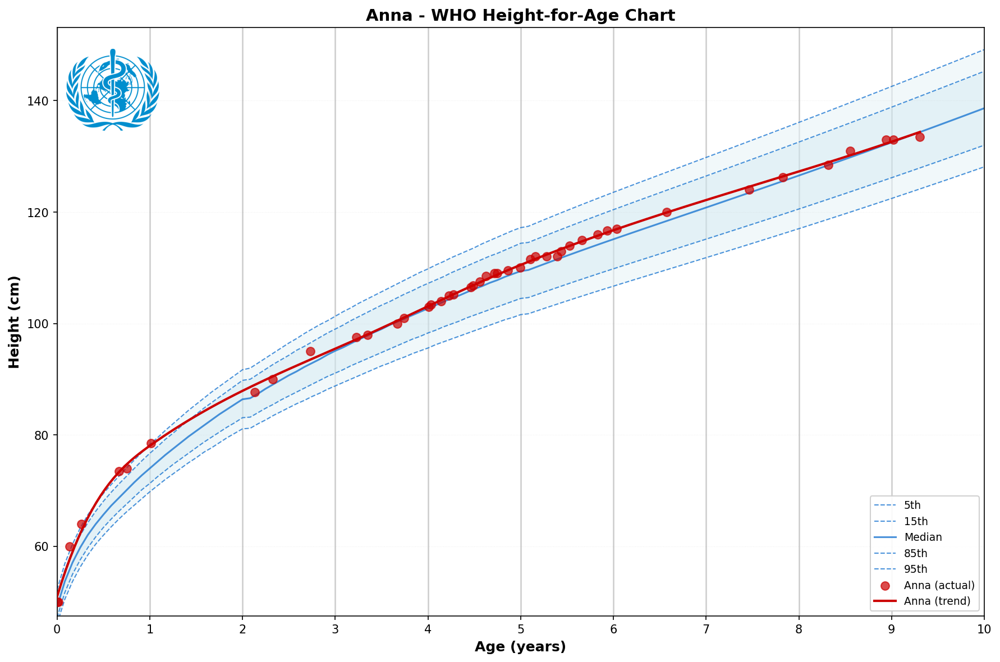
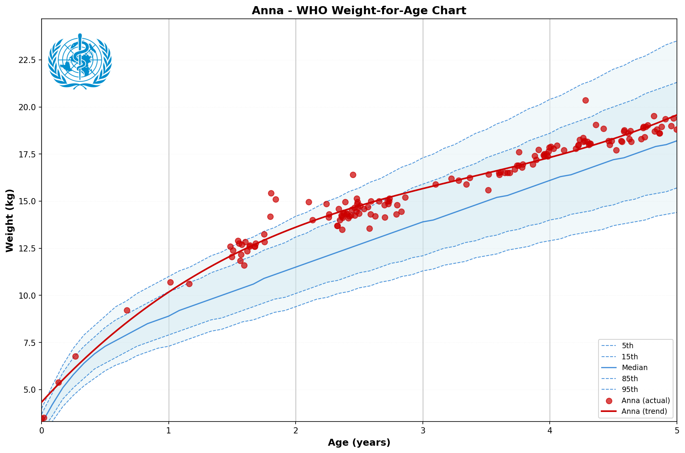
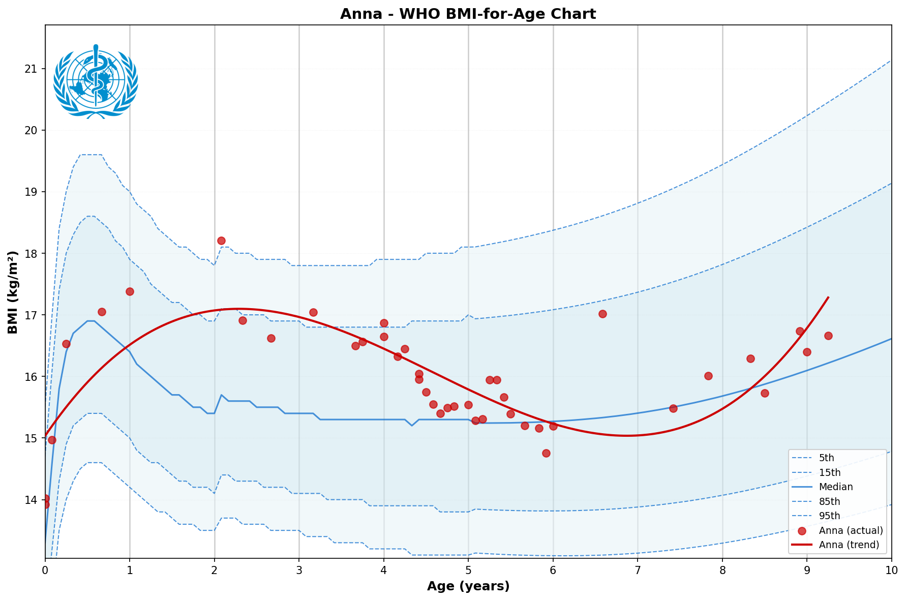

Generate WHO Child Growth Standards charts with percentile curves and child data overlay.

## Features

- **Height-for-age** (0-19 years)
- **Weight-for-age** (0-10 years)
- **BMI-for-age** (0-19 years)
- Supports **boys and girls**
- **Downloads WHO data on demand** from cdn.who.int (cached locally)
- Overlays child's actual measurements with trend line

## Examples

| Height | Weight | BMI |
|--------|--------|-----|
|  |  |  |

## Prerequisites

Install Python dependencies:
```bash
pip install pandas matplotlib scipy openpyxl
```

## Usage

### Basic Chart Generation

```bash
python3 ./scripts/growth_chart.py "Child Name" "DD.MM.YYYY" --sex F --type all
```

Arguments:
- `name`: Child's name (used in chart title)
- `birthdate`: Date of birth in DD.MM.YYYY format
- `--sex` / `-s`: `F` (female) or `M` (male) — default: F
- `--type` / `-t`: `height`, `weight`, `bmi`, or `all` — default: all
- `--data` / `-d`: JSON file with measurement data
- `--output` / `-o`: Output directory for charts

### With Measurement Data

Create a JSON file with height/weight measurements (heights in meters, weights in kg):
```json
{
  "heights": [ ["2024-01-15T10:00:00", 1.05] ],
  "weights": [ ["2024-01-15T10:00:00", 17.5] ]
}
```

```bash
python3 ./scripts/growth_chart.py "Emma" "06.07.2016" --sex F --data emma_data.json --type all
```

### Integration with Withings

Combine with `withings-family` skill to fetch weight data automatically:
```bash
# Get Withings weight data (assuming withings-family skill is installed)
python3 ../withings-family/scripts/withings.py emma body > /tmp/withings.json

# Parse and generate charts
# (The growth chart script handles Withings JSON format if implemented, otherwise transform it)
```

## Output

By default, charts and cache are written to:

- `<workspace>/who-growth-charts/`
- `<workspace>/who-growth-charts/cache/`

Where `<workspace>` is the folder that contains your `skills/` directory (the script finds it automatically; it also prefers the current working directory if it looks like a workspace, which makes symlinked workspaces behave correctly).

You can override workspace discovery with `WHO_GROWTH_CHARTS_WORKSPACE=/path/to/workspace`.
